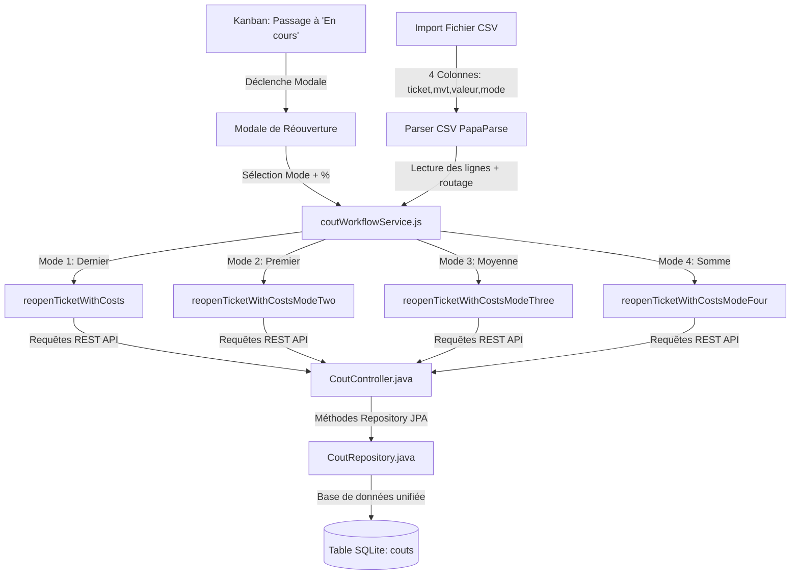

# Conception & Implémentation des 4 Modes de Réouverture Financière

Ce guide technique détaille la démarche de conception et d'implémentation pour l'introduction de **quatre modes de calcul** lors de la réouverture financière des tickets, aussi bien depuis l'interface **Kanban** que via l'**import CSV**.

---

## 1. Vue d'Ensemble & Architecture

Pour implémenter cette fonctionnalité proprement et éviter les duplications de code, l'architecture repose sur **trois couches** unifiées :



---

## 2. Couche de Persistance & API (Spring Boot / SQLite)

La base SQLite contient une table unifiée `couts` regroupant les types `Supercout`, `reouverture` et `glpi`. 
Chaque opération de clôture ou réouverture génère un groupe d'enregistrements identifié par un timestamp unique (`grp`) pour permettre la proration s'il y a plusieurs équipements (items) associés.

### A. Requêtes de calcul dans `CoutRepository.java`
Pour supporter les 4 modes de calcul, le Repository doit exposer des requêtes JPQL ciblées :

| Mode | Description | Requête JPQL Associée |
| :--- | :--- | :--- |
| **Mode 1** | **Dernier Supercout** | Récupère le groupe ayant le `MAX(grp)` (le plus récent) pour calculer le coût. |
| **Mode 2** | **Premier Supercout** | Récupère le groupe ayant le `MIN(grp)` (le plus ancien) pour ce ticket. |
| **Mode 3** | **Moyenne** | Effectue la somme des coûts divisée par le nombre de groupes de `Supercout` distincts. |
| **Mode 4** | **Somme** | Effectue la somme brute cumulée de tous les `Supercout` enregistrés pour ce ticket. |

Voici comment implémenter ces requêtes dans `CoutRepository.java` :

```java
@Repository
public interface CoutRepository extends JpaRepository<Cout, Long> {

    // Mode 1 : Sélectionner tout le dernier groupe de Supercout
    @Query("SELECT c FROM Cout c WHERE c.idTicket = :idTicket AND c.typeCout = 'Supercout' " +
           "AND c.grp = (SELECT MAX(c2.grp) FROM Cout c2 WHERE c2.idTicket = :idTicket AND c2.typeCout = 'Supercout')")
    List<Cout> findAllLatestGroupByIdTicketAndTypeCout(@Param("idTicket") Long idTicket);

    // Mode 2 : Sélectionner tout le premier groupe de Supercout
    @Query("SELECT c FROM Cout c WHERE c.idTicket = :idTicket AND c.typeCout = 'Supercout' " +
           "AND c.grp = (SELECT MIN(c2.grp) FROM Cout c2 WHERE c2.idTicket = :idTicket AND c2.typeCout = 'Supercout')")
    List<Cout> findAllFirstGroupByIdTicketAndTypeCout(@Param("idTicket") Long idTicket);

    // Mode 3 : Calculer la moyenne des Supercouts (somme divisée par le nombre de groupes distincts)
    @Query("SELECT SUM(c.cout) / COUNT(DISTINCT c.grp) FROM Cout c WHERE c.idTicket = :idTicket AND c.typeCout = 'Supercout'")
    Double findAverageByIdTicketAndTypeCout(@Param("idTicket") Long idTicket);

    // Mode 4 : Somme totale brute de tous les Supercouts
    @Query("SELECT SUM(c.cout) FROM Cout c WHERE c.idTicket = :idTicket AND c.typeCout = 'Supercout'")
    Double findSumByIdTicketAndTypeCout(@Param("idTicket") Long idTicket);
}
```

---

## 3. Logique Applicative Centralisée (`coutWorkflowService.js`)

Pour éviter de disperser le code de calcul entre le tableau Kanban et l'import de fichier, toute la logique de répartition et de proration doit être centralisée dans un service Javascript unique. 

> [!IMPORTANT]
> **Règle de Proration :** S'il y a plusieurs équipements associés au ticket au moment de la réouverture, la base de calcul (Moyenne ou Somme globale) doit être divisée équitablement entre le nombre d'équipements du dernier groupe d'intervention pour conserver la cohérence par équipement.

```javascript
import { fetchDataAPIRest } from './apiClient';
import { createCout, getLatestGroupCouts, getFirstGroupCouts, getAverageCout, getSumCout } from './coutService';

// =========================================================================
// MODE 1 : Basé sur le tout dernier Supercout du ticket
// =========================================================================
export async function reopenTicketWithCosts(ticketId, percentage, options = {}) {
  const latestGroup = await getLatestGroupCouts(ticketId, 'Supercout');
  if (!latestGroup || latestGroup.length === 0) {
    throw new Error(`Aucun Supercout trouvé pour le ticket #${ticketId}`);
  }
  const grp = Date.now();
  const createdIds = [];
  
  for (const entry of latestGroup) {
    const coutReouv = parseFloat(((entry.cout * percentage) / 100).toFixed(2));
    const res = await createCout({
      idTicket: ticketId, typeCout: 'reouverture', cout: coutReouv,
      idItem: entry.idItem ?? null, category: entry.category ?? null, grp
    });
    if (res?.idAuto) createdIds.push(res.idAuto);
  }
  await updateGLPIStatusToInProgress(ticketId, options);
  return createdIds;
}

// =========================================================================
// MODE 2 : Basé sur le tout premier Supercout du ticket
// =========================================================================
export async function reopenTicketWithCostsModeTwo(ticketId, percentage, options = {}) {
  const firstGroup = await getFirstGroupCouts(ticketId, 'Supercout');
  if (!firstGroup || firstGroup.length === 0) {
    throw new Error(`Aucun Supercout trouvé pour le ticket #${ticketId}`);
  }
  const grp = Date.now();
  const createdIds = [];

  for (const entry of firstGroup) {
    const coutReouv = parseFloat(((entry.cout * percentage) / 100).toFixed(2));
    const res = await createCout({
      idTicket: ticketId, typeCout: 'reouverture', cout: coutReouv,
      idItem: entry.idItem ?? null, category: entry.category ?? null, grp
    });
    if (res?.idAuto) createdIds.push(res.idAuto);
  }
  await updateGLPIStatusToInProgress(ticketId, options);
  return createdIds;
}

// =========================================================================
// MODE 3 : Basé sur la moyenne des Supercouts
// =========================================================================
export async function reopenTicketWithCostsModeThree(ticketId, percentage, options = {}) {
  const average = await getAverageCout(ticketId, 'Supercout');
  const latestGroup = await getLatestGroupCouts(ticketId, 'Supercout');
  if (!latestGroup || latestGroup.length === 0) {
    throw new Error(`Aucun Supercout trouvé pour le ticket #${ticketId}`);
  }
  const grp = Date.now();
  const createdIds = [];
  
  // Proratisation par rapport au nombre d'équipements du dernier groupe
  const averageParItem = average / latestGroup.length;

  for (const entry of latestGroup) {
    const coutReouv = parseFloat(((averageParItem * percentage) / 100).toFixed(2));
    const res = await createCout({
      idTicket: ticketId, typeCout: 'reouverture', cout: coutReouv,
      idItem: entry.idItem ?? null, category: entry.category ?? null, grp
    });
    if (res?.idAuto) createdIds.push(res.idAuto);
  }
  await updateGLPIStatusToInProgress(ticketId, options);
  return createdIds;
}

// =========================================================================
// MODE 4 : Basé sur la somme des Supercouts
// =========================================================================
export async function reopenTicketWithCostsModeFour(ticketId, percentage, options = {}) {
  const sum = await getSumCout(ticketId, 'Supercout');
  const latestGroup = await getLatestGroupCouts(ticketId, 'Supercout');
  if (!latestGroup || latestGroup.length === 0) {
    throw new Error(`Aucun Supercout trouvé pour le ticket #${ticketId}`);
  }
  const grp = Date.now();
  const createdIds = [];
  
  // Proratisation par rapport au nombre d'équipements du dernier groupe
  const sumParItem = sum / latestGroup.length;

  for (const entry of latestGroup) {
    const coutReouv = parseFloat(((sumParItem * percentage) / 100).toFixed(2));
    const res = await createCout({
      idTicket: ticketId, typeCout: 'reouverture', cout: coutReouv,
      idItem: entry.idItem ?? null, category: entry.category ?? null, grp
    });
    if (res?.idAuto) createdIds.push(res.idAuto);
  }
  await updateGLPIStatusToInProgress(ticketId, options);
  return createdIds;
}

// Fonction utilitaire pour modifier le statut dans GLPI
async function updateGLPIStatusToInProgress(ticketId, options) {
  if (options.updateGLPIStatus) {
    await fetchDataAPIRest(`Ticket/${ticketId}`, {
      method: 'PUT',
      body: { input: { id: ticketId, status: 2 } } // 2 = En cours
    });
  }
}
```

---

## 4. Intégration dans le Tableau Kanban (UI Réactive)

Dans le tableau Kanban, lorsqu'un utilisateur effectue un glisser-déposer d'un ticket depuis la colonne **Clos** (status 6) vers la colonne **En cours** (status 2), une modale de confirmation interactive s'ouvre : `TicketApprovalFormModal.jsx`.

### Déroulement de l'UI :
1. **Étape 1 : Choix de la nature du retour**
   L'utilisateur a le choix entre :
   - *Annuler* les coûts (Appel à `cancelTicketCosts` pour créer une écriture négative équivalente).
   - Faire une *Réouverture* (Passage à l'Étape 2).
2. **Étape 2 : Formulaire de paramétrage de la réouverture**
   L'interface demande explicitement à l'utilisateur :
   - **Le mode de calcul** (1, 2, 3 ou 4) via un menu déroulant `<Select>`.
   - **Le pourcentage de réouverture** (ex. `25` pour 25%) via un `<Input type="number">`.

```jsx
// Extrait de l'affichage dans TicketApprovalFormModal.jsx
{step === STEP_FORM && (
  <form onSubmit={handleReouverture} className="space-y-4">
    <div>
      <label className="block text-xs font-bold text-neutral-500 uppercase tracking-wider mb-2">
        Mode de calcul de réouverture
      </label>
      <Select value={selectedMode} onChange={(e) => setSelectedMode(e.target.value)}>
        <option value="1">Mode 1 : Dernier Supercout</option>
        <option value="2">Mode 2 : Premier Supercout</option>
        <option value="3">Mode 3 : Moyenne des Supercouts</option>
        <option value="4">Mode 4 : Somme des Supercouts</option>
      </Select>
    </div>

    <div>
      <label className="block text-xs font-bold text-neutral-500 uppercase tracking-wider mb-2">
        Pourcentage (%)
      </label>
      <Input
        type="number"
        step="0.01"
        min="0.01"
        value={percentage}
        onChange={(e) => setPercentage(e.target.value)}
        placeholder="Ex: 25.0"
        required
      />
    </div>

    <div className="flex justify-end gap-2">
      <Button type="button" variant="outline" onClick={() => setStep(STEP_CHOICE)}>
        Retour
      </Button>
      <Button type="submit" variant="primary">
        Valider la réouverture
      </Button>
    </div>
  </form>
)}
```

---

## 5. Importation par Lot (CSV à 4 Colonnes)

Pour automatiser cette opération à grande échelle, le module d'import CSV accepte un fichier contenant une **4ème colonne** spécifiant le mode de calcul (1, 2, 3 ou 4) pour les réouvertures.

### Format attendu du fichier CSV :
`ticket, mouvement, valeur, mode`

```csv
105, reouverture, 15.5, 3
108, close, 250.00
112, reouverture, 10.0, 1
105, cancel
```

### Règle d'or de robustesse :
> [!WARNING]
> **Gestion de la virgule décimale dans les fichiers non-guillemetés :**
> Si le CSV contient une virgule décimale non entourée de guillemets (ex: `105,reouverture,15,5,3`), le parser va diviser la ligne en 5 colonnes au lieu de 4. 
> Le parser doit donc détecter cette anomalie de taille et reconstruire intelligemment la valeur numérique :
> - Si `cleanColumns.length === 5` et que la colonne index 4 contient le mode, on fusionne l'index 2 et l'index 3 avec un point décimal (ex: `15` + `.` + `5` = `15.5`).

### Logique du Parser robuste dans `importSqlite.js` :
```javascript
export const parseCSVToCouts = (csvText) => {
  const parsed = Papa.parse(csvText, { header: false, skipEmptyLines: 'greedy' });
  const rows = parsed.data || [];
  
  // Ignorer l'en-tête textuel si présent
  const startIndex = (rows[0] && isNaN(Number(rows[0][0]))) ? 1 : 0;

  return rows.slice(startIndex).map((columns) => {
    const clean = columns.map(c => c !== null ? String(c).trim() : '');

    // Gestion de la virgule décimale non guillemetée décalant le mode en colonne 5
    if (clean.length >= 5 && clean[4] !== '' && !isNaN(Number(clean[2])) && !isNaN(Number(clean[3]))) {
      return {
        ticket: clean[0],
        mvt: clean[1],
        valeur: clean[2] + '.' + clean[3], // Reconstitution de 15,5 en 15.5
        mode: clean[4]
      };
    }

    // Comportement standard à 4 colonnes (ou moins si annulation/clôture sans mode)
    return {
      ticket: clean[0],
      mvt: clean[1],
      valeur: clean[2] || '',
      mode: clean[3] || ''
    };
  }).filter(c => c.ticket !== '' && c.mvt !== '');
};
```

### Transaction & Rollback (Tout ou Rien) :
Durant le traitement des lignes importées, si une erreur survient sur n'importe quel ticket (ex. ticket inexistant dans GLPI, calcul impossible), **tous les coûts insérés durant cette session d'importation sont supprimés de SQLite** grâce à l'historique des identifiants créés, laissant la base de données propre.

---

## 6. Synthèse des Avantages de cette Conception

1. **Pas de Duplication :** Les calculs mathématiques complexes et la proration sur les équipements sont isolés dans `coutWorkflowService.js`, rendant l'interface Kanban et l'importateur CSV très légers et faciles à maintenir.
2. **Tolérance aux erreurs de format :** Le parser est capable de corriger de lui-même des fichiers CSV mal exportés (virgules décimales non protégées par des guillemets).
3. **Sécurité Métier :** Le mécanisme de rollback transactionnel à la volée évite les importations partielles corrompues, protégeant la base de données SQLite locale.
