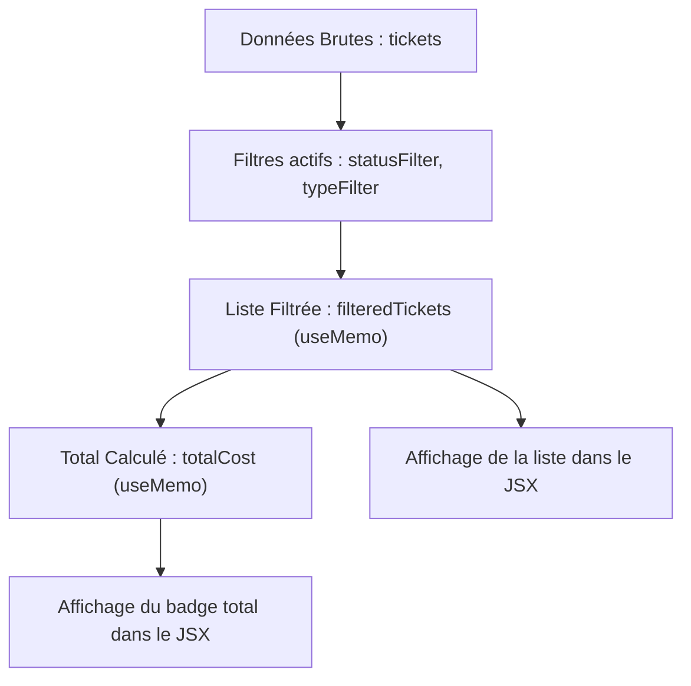

# Guide d'Apprentissage : Calculer un Total et Appliquer des Filtres Réactifs en React

Ce guide explique la méthode standard et optimisée pour **calculer une somme ou un total cumulé à partir d'une liste de données, tout en appliquant des filtres dynamiques** (comme le cas des coûts de tickets filtrés par statut ou type). 

C'est un modèle de conception (Design Pattern) fondamental et très fréquent lors des évaluations pratiques.

---

## Le Concept Clé : La Cascade Réactive

Pour éviter les bugs de désynchronisation (où la liste est filtrée mais le total reste faux, ou inversement), il faut toujours organiser vos données sous forme de cascade :



En faisant dépendre le calcul du **Total** uniquement de la **Liste Filtrée**, toute modification d'un filtre mettra à jour la liste filtrée, ce qui recalculera automatiquement et instantanément le total.

---

## Tutoriel Étape par Étape

### Étape 1 : Déclarer les états de filtres
Déclarez les filtres dans le composant avec des valeurs initiales (généralement `'all'`).

```javascript
const [statusFilter, setStatusFilter] = useState('all');
const [typeFilter, setTypeFilter] = useState('all');
```

---

### Étape 2 : Filtrer la liste (Premier `useMemo`)
Créez la sous-liste filtrée. On utilise `useMemo` pour éviter de refaire le filtrage à chaque rendu cosmétique du composant.

```javascript
const filteredTickets = useMemo(() => {
  let result = tickets; // On part des données brutes

  // 1. Application du filtre par type si actif
  if (typeFilter !== 'all') {
    result = result.filter(t => t.type === typeFilter);
  }

  // 2. Application du filtre par statut si actif
  if (statusFilter !== 'all') {
    result = result.filter(t => String(t.status) === statusFilter);
  }

  return result; // Renvoie la liste filtrée
}, [tickets, typeFilter, statusFilter]); // Recalculé dès qu'un filtre ou la liste brute change
```

---

### Étape 3 : Calculer la somme (Deuxième `useMemo`)
Calculez la somme cumulative en utilisant la méthode JavaScript `.reduce()`. 

> [!IMPORTANT]
> Ce `useMemo` dépend **uniquement** de `filteredTickets`. C'est le secret pour que le prix suive automatiquement le filtre !

```javascript
const totalFixedCost = useMemo(() => {
  // On réduit la liste filtrée à une seule valeur numérique
  return filteredTickets.reduce((accumulator, ticket) => {
    // Si votre ticket a des lignes imbriquées (unrolledLines) :
    const ticketCost = ticket.unrolledLines
      ? ticket.unrolledLines.reduce((sum, line) => sum + (line.cost_fixed || 0), 0)
      : (ticket.cost_fixed || 0);

    return accumulator + ticketCost;
  }, 0); // 0 est la valeur de départ de l'accumulateur
}, [filteredTickets]); // Dépend UNIQUE-MENT de filteredTickets
```

---

### Étape 4 : Rendre le tout dans le JSX
Affichez les sélecteurs de filtres, le total mis à jour, et la liste.

```jsx
return (
  <div className="p-6">
    {/* Zone des Filtres */}
    <div className="flex gap-4 mb-6">
      <select value={statusFilter} onChange={(e) => setStatusFilter(e.target.value)}>
        <option value="all">Tous les statuts</option>
        <option value="1">Nouveau</option>
        <option value="6">Terminé</option>
      </select>

      <select value={typeFilter} onChange={(e) => setTypeFilter(e.target.value)}>
        <option value="all">Tous les types</option>
        <option value="incident">Incident</option>
        <option value="demande">Demande</option>
      </select>
    </div>

    {/* Affichage du total filtré */}
    <div className="bg-white p-4 rounded-lg shadow mb-6">
      <h3>Coût Fixe Total (Filtré)</h3>
      <p className="text-2xl font-bold">{totalFixedCost.toFixed(2)} €</p>
      <p className="text-xs text-neutral-500">
        Basé sur {filteredTickets.length} ticket(s) affiché(s)
      </p>
    </div>

    {/* Liste des tickets filtrés */}
    <div className="space-y-2">
      {filteredTickets.map(t => (
        <div key={t.id} className="p-3 border rounded bg-gray-50">
          <strong>{t.name}</strong> - Statut : {t.status}
        </div>
      ))}
    </div>
  </div>
);
```

---

## Les 3 Règles d'Or pour l'Examen :

1. **Ne stockez pas le Total dans un `useState`** : Si vous faites `setTotal(...)` dans un effet, vous risquez de provoquer des doubles rendus ou des boucles infinies. Laissez `useMemo` calculer la valeur dynamiquement.
2. **Ne filtrez pas directement dans le rendu (JSX)** : Ne faites pas `{tickets.filter(...).map(...)}` tout en calculant le total ailleurs, car vous perdrez le lien entre le total affiché et les éléments visibles.
3. **Sécurisez vos additions** : SQLite et les fichiers CSV importés peuvent contenir des valeurs vides (`null`, `undefined`) ou des formats chaînes (ex: `"15,50"` au lieu de `15.5`). Pensez toujours à convertir proprement :
   ```javascript
   const safeValue = parseFloat(String(val).replace(',', '.')) || 0;
   ```
