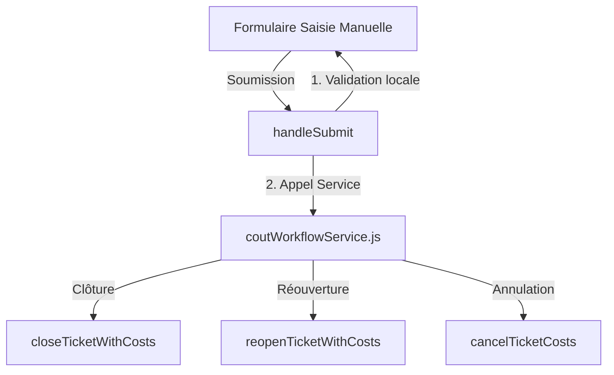

# Scénario : Saisie Manuelle de l'Importation de Coûts

Ce document décrit le scénario et l'implémentation de la **Saisie Manuelle de l'Importation**, qui permet à un utilisateur de saisir directement un mouvement financier via un formulaire plutôt que de charger un fichier CSV. Ce formulaire applique la même logique métier centralisée que le **Tableau Kanban** et l'**Import CSV** (`importSqlite.js`), en s'appuyant sur `coutWorkflowService.js`.

---

## 1. Description du Formulaire

Le formulaire de saisie manuelle comporte les trois champs principaux :
*   **Ticket** : L'identifiant (ID) du ticket GLPI concerné (ex. `120`).
*   **Mouvement (mvt)** : Le type de mouvement financier à appliquer.
    *   `reouverture` (ou `open`)
    *   `termine` (ou `close` / `clôturé`)
    *   `annulation` (ou `cancel` / `annuler`)
*   **Valeur** : Le montant ou le pourcentage associé au mouvement :
    *   Pour `termine` : Le coût total brut (ex. `150.00`).
    *   Pour `reouverture` : Le pourcentage du coût précédent à imputer (ex. `20` pour 20%).
    *   Pour `annulation` : Non requis ou ignoré (la valeur négative du dernier coût est calculée automatiquement).

---

## 2. Logique Métier Commune (`coutWorkflowService`)

Pour garantir l'intégrité des données et éviter la duplication de logique, le formulaire appelle directement les méthodes du service centralisé `coutWorkflowService.js`.



### Détail des Fonctions du Service Appelées :
1.  **Clôture (`termine` / `close`)** :
    *   Appelle `closeTicketWithCosts(ticketId, totalCost, { updateGLPIStatus: true })`.
    *   Récupère les équipements liés au ticket dans GLPI via `Item_Ticket`.
    *   Proratise et insère les lignes dans la table SQLite `couts` (type `Supercout`).
    *   Met à jour le statut du ticket à **Clos** (statut `6`) dans GLPI.
2.  **Réouverture (`reouverture` / `open`)** :
    *   Appelle `reopenTicketWithCosts(ticketId, percentage, { updateGLPIStatus: true })`.
    *   Recherche le dernier groupe de `Supercout` SQLite pour ce ticket.
    *   Insère les lignes SQLite de type `reouverture` avec le montant proratisé selon le pourcentage.
    *   Repasse le statut du ticket à **En cours** (statut `2`) dans GLPI.
3.  **Annulation (`annulation` / `cancel`)** :
    *   Appelle `cancelTicketCosts(ticketId, { updateGLPIStatus: true })`.
    *   Recherche le dernier groupe de `Supercout` SQLite pour ce ticket.
    *   Insère des lignes d'annulation (valeur négative du `Supercout`) dans SQLite.
    *   Remet le statut du ticket à **En cours** (statut `2`) dans GLPI.

---

## 3. Exemple d'Implémentation du Composant React

Voici comment structurer le composant React pour ce formulaire de saisie manuelle :

```jsx
import { useState } from 'react';
import { Card, Button, Input, Select, Alert, Spinner } from '../../components/templates';
import { 
  closeTicketWithCosts, 
  reopenTicketWithCosts, 
  cancelTicketCosts 
} from '../../services/coutWorkflowService';
import { fetchDataAPIRest } from '../../services/apiClient';

export default function ImportForm() {
  const [ticketId, setTicketId] = useState('');
  const [mvt, setMvt] = useState('termine');
  const [valeur, setValeur] = useState('');
  
  const [loading, setLoading] = useState(false);
  const [error, setError] = useState(null);
  const [success, setSuccess] = useState(null);

  const handleSubmit = async (e) => {
    e.preventDefault();
    setError(null);
    setSuccess(null);

    const searchRef = String(ticketId).trim();
    if (!searchRef) {
      setError("Veuillez saisir un identifiant ou une référence de ticket.");
      return;
    }

    setLoading(true);
    try {
      // 1. Récupérer tous les tickets de GLPI pour faire la correspondance (comme dans importSqlite.js)
      let allTickets = [];
      let start = 0;
      const limit = 500;
      while (true) {
        const data = await fetchDataAPIRest(`Ticket?range=${start}-${start + limit - 1}`);
        if (!data || !Array.isArray(data) || data.length === 0) break;
        allTickets = allTickets.concat(data);
        if (data.length < limit) break;
        start += limit;
      }

      // 2. Trouver le ticket correspondant par externalid ou à défaut par ID GLPI direct
      let matchedTicket = allTickets.find(t => t.externalid && String(t.externalid).trim() === searchRef);
      if (!matchedTicket) {
        matchedTicket = allTickets.find(t => String(t.id) === searchRef);
      }

      if (!matchedTicket) {
        throw new Error(`Aucun ticket trouvé avec la référence ou ID "${searchRef}" dans GLPI.`);
      }

      const realTicketId = Number(matchedTicket.id);
      let createdIds = [];

      if (mvt === 'termine') {
        const costVal = parseFloat(valeur.replace(',', '.'));
        if (isNaN(costVal) || costVal < 0) {
          throw new Error("Veuillez saisir un coût positif valide.");
        }
        createdIds = await closeTicketWithCosts(realTicketId, costVal, { updateGLPIStatus: true });
        setSuccess(`Ticket #${realTicketId} (Réf: ${searchRef}) clôturé avec succès. ${createdIds.length} ligne(s) de coût créée(s).`);

      } else if (mvt === 'reouverture') {
        const pctVal = parseFloat(valeur.replace(',', '.'));
        if (isNaN(pctVal) || pctVal <= 0 || pctVal > 100) {
          throw new Error("Veuillez saisir un pourcentage valide entre 1 et 100.");
        }
        createdIds = await reopenTicketWithCosts(realTicketId, pctVal, { updateGLPIStatus: true });
        setSuccess(`Ticket #${realTicketId} (Réf: ${searchRef}) réouvert avec succès (${pctVal}%). ${createdIds.length} ligne(s) de réouverture créée(s).`);

      } else if (mvt === 'annulation') {
        createdIds = await cancelTicketCosts(realTicketId, { updateGLPIStatus: true });
        setSuccess(`Annulation des coûts effectuée pour le ticket #${realTicketId} (Réf: ${searchRef}). ${createdIds.length} ligne(s) d'annulation créée(s).`);
      }

      // Reset du formulaire après succès
      setTicketId('');
      setValeur('');
    } catch (err) {
      console.error(err);
      setError(`Échec de l'opération : ${err.message}`);
    } finally {
      setLoading(false);
    }
  };

  return (
    <Card className="max-w-lg mx-auto p-6 bg-white border border-neutral-200 shadow-sm rounded-xl">
      <h2 className="text-lg font-bold text-neutral-800 mb-4">Saisie Manuelle d'un Coût/Mouvement</h2>
      
      {error && <Alert variant="danger" className="mb-4">{error}</Alert>}
      {success && <Alert variant="success" className="mb-4">{success}</Alert>}

      <form onSubmit={handleSubmit} className="space-y-4">
        <div>
          <label className="block text-xs font-bold text-neutral-500 uppercase tracking-wider mb-2">
            ID Ticket
          </label>
          <Input 
            type="number" 
            placeholder="Ex: 42" 
            value={ticketId} 
            onChange={(e) => setTicketId(e.target.value)}
            disabled={loading}
            required
          />
        </div>

        <div>
          <label className="block text-xs font-bold text-neutral-500 uppercase tracking-wider mb-2">
            Mouvement (Mvt)
          </label>
          <Select 
            value={mvt} 
            onChange={(e) => {
              setMvt(e.target.value);
              setValeur(''); 
            }}
            disabled={loading}
          >
            <option value="termine">Clôture (Supercout)</option>
            <option value="reouverture">Réouverture (reouverture)</option>
            <option value="annulation">Annulation (annulation)</option>
          </Select>
        </div>

        {mvt !== 'annulation' && (
          <div>
            <label className="block text-xs font-bold text-neutral-500 uppercase tracking-wider mb-2">
              {mvt === 'termine' ? 'Montant du Coût (€)' : 'Pourcentage de réouverture (%)'}
            </label>
            <Input 
              type="text" 
              placeholder={mvt === 'termine' ? "Ex: 250.50" : "Ex: 15"} 
              value={valeur} 
              onChange={(e) => setValeur(e.target.value)}
              disabled={loading}
              required
            />
          </div>
        )}

        <Button type="submit" variant="primary" className="w-full flex items-center justify-center" disabled={loading}>
          {loading ? <Spinner size="sm" className="mr-2" /> : null}
          {loading ? "Traitement..." : "Appliquer le mouvement"}
        </Button>
      </form>
    </Card>
  );
}
```

---

## 4. Scénario de Test et Validation

> [!NOTE]
> Pour exécuter ce scénario de test, assurez-vous que la base de données SQLite locale et le serveur GLPI sont en cours d'exécution.

### Cas de Test 1 : Clôture Manuelle
1.  Saisir un ID de ticket existant lié à au moins un équipement (ex: `Ticket #12`).
2.  Sélectionner le mouvement **Clôture (Supercout)**.
3.  Saisir le montant `300` dans le champ valeur.
4.  Cliquer sur **Appliquer le mouvement**.
5.  **Vérification attendue** :
    *   Le ticket passe au statut **Clos** dans GLPI.
    *   Les coûts sont insérés dans SQLite, divisés par le nombre d'équipements liés.
    *   La page d'accueil ou le tableau de bord affiche le total mis à jour.

### Cas de Test 2 : Réouverture Manuelle à 50%
1.  Saisir le même ID de ticket (`Ticket #12`).
2.  Sélectionner le mouvement **Réouverture (reouverture)**.
3.  Saisir la valeur `50` (pour 50%).
4.  Cliquer sur **Appliquer le mouvement**.
5.  **Vérification attendue** :
    *   Le ticket repasse au statut **En cours** dans GLPI.
    *   Des lignes de type `reouverture` sont créées dans SQLite avec des montants égaux à la moitié des montants des lignes de clôture précédentes.

### Cas de Test 3 : Annulation
1.  Saisir le même ID de ticket (`Ticket #12`).
2.  Sélectionner le mouvement **Annulation (annulation)**.
3.  La saisie de valeur est masquée. Cliquer sur **Appliquer le mouvement**.
4.  **Vérification attendue** :
    *   Le ticket repasse au statut **En cours** dans GLPI.
    *   Des lignes de type `annulation` avec des coûts négatifs sont insérées pour annuler l'impact financier du dernier `Supercout`.

---

## 5. Alternative : Utilisation d'un Champ de Saisie Texte Multilingue (Français/Anglais)

Si le champ **Mouvement** est proposé sous forme de saisie libre (champ `input type="text"`) plutôt que d'un menu déroulant (`select`), l'utilisateur peut entrer des termes variés en français ou en anglais, avec ou sans accents, et dans différentes casses.

Pour gérer cette flexibilité, il convient de normaliser la saisie utilisateur avant le traitement.

### Fonction de Normalisation du Mouvement

Voici une fonction de normalisation JavaScript permettant de ramener les différents synonymes anglais et français vers les trois clés attendues par `coutWorkflowService.js` (`termine`, `reouverture`, `annulation`) :

```javascript
const normalizeMovementText = (inputText) => {
  if (!inputText) return null;

  // 1. Mise en minuscules, nettoyage des espaces et suppression des accents
  const normalized = inputText
    .trim()
    .toLowerCase()
    .normalize("NFD")
    .replace(/[\u0300-\u036f]/g, ""); // Remplace réouverture par reouverture, terminé par termine...

  // 2. Correspondances par mots-clés (Anglais / Français)
  
  // Terminé / Clôturé / Close / Closed
  if (
    normalized.includes("termine") ||
    normalized.includes("cloture") ||
    normalized.includes("close") ||
    normalized.includes("finish")
  ) {
    return "termine";
  }

  // Réouverture / Reopen / Open
  if (
    normalized.includes("reouverture") ||
    normalized.includes("reopen") ||
    normalized.includes("open")
  ) {
    return "reouverture";
  }

  // Annulation / Annuler / Cancel / Canceled
  if (
    normalized.includes("annulation") ||
    normalized.includes("annuler") ||
    normalized.includes("cancel")
  ) {
    return "annulation";
  }

  return null; // Mouvement inconnu
};
```

### Intégration dans le Formulaire de Saisie

Lors de la soumission du formulaire, on valide la valeur normalisée :

```javascript
const handleSubmit = async (e) => {
  e.preventDefault();
  setError(null);
  setSuccess(null);

  // Normalisation du texte de mouvement saisi libre
  const normalizedMvt = normalizeMovementText(mvtInputText);
  if (!normalizedMvt) {
    setError("Mouvement non reconnu. Saisissez par exemple : Clôturé, Réouverture, ou Annuler.");
    return;
  }

  // La suite du traitement utilise normalizedMvt au lieu de mvt...
  if (normalizedMvt === 'termine') {
    // ...
  }
};
```

