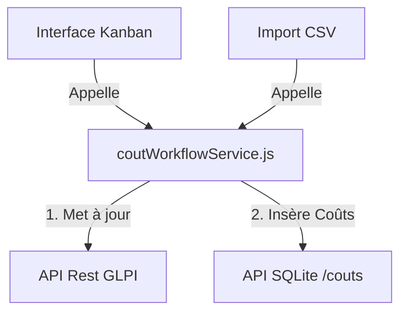

# Centralisation de la Logique Métier des Coûts (Kanban & Import)

Ce document explique comment centraliser et unifier la logique métier liée à la gestion des coûts (clôture, réouverture, annulation) afin qu'elle soit partagée de manière identique entre le **Tableau Kanban** et l'**Import CSV**.

---

## 1. Constat Actuel et Problématique

Actuellement, les opérations financières sur les tickets sont dupliquées à deux endroits dans le code :
1. **Dans l'interface Kanban (React)** : via `TicketApprovalModal.jsx` (clôture/termine) et `TicketApprovalFormModal.jsx` (annulation & réouverture). Ces composants effectuent des calculs locaux, insèrent les coûts dans SQLite, et modifient également le statut des tickets dans GLPI (statuts 6 pour clos, 2 pour en cours).
2. **Dans l'import SQLite (`importSqlite.js`)** : via le parsing du fichier CSV. Ce script contient ses propres boucles de calcul pour préméditer la répartition des coûts et insérer les lignes dans SQLite. Cependant, il ne met pas à jour le statut des tickets dans GLPI et duplique une grande partie des algorithmes de calcul.

### Conséquences :
* **Redondance de code** : Si la règle de calcul du prorata d'un coût change, il faut la modifier dans les deux fichiers.
* **Écarts comportementaux** : L'import ne synchronise pas les statuts de tickets GLPI alors que le Kanban le fait.
* **Complexité de maintenance** : Risque d'incohérence entre les données réelles de GLPI et les coûts saisis localement dans SQLite.

---

## 2. Architecture Cible

Pour résoudre ce problème, nous allons centraliser toute la logique métier dans un service unique : **`coutWorkflowService.js`** (ou étendre `coutService.js`). 

Ce service fournira 3 fonctions clés asynchrones qui prendront en charge :
1. Les appels API GLPI (changement de statut, ajout de suivi de refus).
2. La recherche d'équipements liés au ticket dans GLPI.
3. Le calcul des coûts (proratisés ou partiels).
4. L'insertion en base SQLite.
5. Le retour des identifiants des lignes créées (indispensable pour le mécanisme de rollback de l'import).



---

## 3. Étape 1 : Création du Service Unifié `coutWorkflowService.js`

Créez un nouveau fichier `deskflow/src/services/coutWorkflowService.js` qui regroupe la logique :

```javascript
import { fetchDataAPIRest } from './apiClient';
import { 
  createCout, 
  getLatestGroupCouts, 
  createAnnulationCouts 
} from './coutService';

/**
 * 1. CLÔTURER/TERMINER UN TICKET (Supercout)
 * Met à jour le statut dans GLPI, ajoute un suivi si demandé,
 * récupère les items reliés et insère les lignes de coût (réparties équitablement).
 */
export async function closeTicketWithCosts(ticketId, totalCost, options = {}) {
  const { 
    updateGLPIStatus = true, 
    followupContent = null 
  } = options;
  
  const createdIds = [];

  // A. Ajout d'un suivi de motif si fourni (ex: motif de refus)
  if (followupContent) {
    await fetchDataAPIRest('ITILFollowup', {
      method: 'POST',
      body: { input: { items_id: ticketId, itemtype: 'Ticket', content: followupContent } },
    });
  }

  // B. Mise à jour du statut du ticket dans GLPI (statut 6 = Clos)
  if (updateGLPIStatus) {
    await fetchDataAPIRest(`Ticket/${ticketId}`, {
      method: 'PUT',
      body: { input: { id: ticketId, status: 6 } },
    });
  }

  // C. Récupération des équipements liés
  let linkedItems = [];
  try {
    const raw = await fetchDataAPIRest(`Ticket/${ticketId}/Item_Ticket`);
    linkedItems = Array.isArray(raw) ? raw : (raw ? [raw] : []);
  } catch (err) {
    console.warn('[SuperCout] Aucun Item_Ticket trouvé ou erreur api:', err.message);
  }

  // D. Répartition et insertion des coûts dans SQLite
  const grp = Date.now();
  if (linkedItems.length === 0) {
    const res = await createCout({
      idTicket: ticketId,
      typeCout: 'Supercout',
      cout: totalCost,
      grp,
    });
    if (res?.idAuto) createdIds.push(res.idAuto);
  } else {
    const coutParItem = parseFloat((totalCost / linkedItems.length).toFixed(2));
    for (const item of linkedItems) {
      const res = await createCout({
        idTicket: ticketId,
        typeCout: 'Supercout',
        cout: coutParItem,
        idItem: item.items_id ?? null,
        category: item.itemtype ?? null,
        grp,
      });
      if (res?.idAuto) createdIds.push(res.idAuto);
    }
  }

  return createdIds;
}

/**
 * 2. RÉOUVRIR UN TICKET (Reouverture)
 * Récupère le dernier Supercout du ticket, calcule le coût au prorata du pourcentage,
 * crée les lignes SQLite de réouverture et repasse le statut du ticket à "En cours" (2).
 */
export async function reopenTicketWithCosts(ticketId, percentage, options = {}) {
  const { updateGLPIStatus = true } = options;
  const createdIds = [];

  // A. Récupérer le dernier groupe Supercout
  const latestGroup = await getLatestGroupCouts(ticketId, 'Supercout');
  if (!latestGroup || latestGroup.length === 0) {
    throw new Error(`Aucun Supercout trouvé pour le ticket #${ticketId}`);
  }

  // B. Insérer une ligne de réouverture par item du groupe d'origine
  const grp = Date.now();
  for (const entry of latestGroup) {
    const coutReouv = parseFloat(((entry.cout * percentage) / 100).toFixed(2));
    const res = await createCout({
      idTicket: ticketId,
      typeCout: 'reouverture',
      cout: coutReouv,
      idItem: entry.idItem ?? null,
      category: entry.category ?? null,
      grp,
    });
    if (res?.idAuto) createdIds.push(res.idAuto);
  }

  // C. Remettre le ticket en cours dans GLPI (statut 2 = En cours)
  if (updateGLPIStatus) {
    await fetchDataAPIRest(`Ticket/${ticketId}`, {
      method: 'PUT',
      body: { input: { id: ticketId, status: 2 } },
    });
  }

  return createdIds;
}

/**
 * 3. ANNULER LES COÛTS D'UN TICKET (Annulation)
 * Crée des lignes négatives pour contrebalancer le dernier Supercout dans SQLite,
 * et remet le ticket en cours dans GLPI.
 */
export async function cancelTicketCosts(ticketId, options = {}) {
  const { updateGLPIStatus = true } = options;
  const createdIds = [];

  // A. Récupérer le dernier groupe Supercout
  const latestGroup = await getLatestGroupCouts(ticketId, 'Supercout');
  if (!latestGroup || latestGroup.length === 0) {
    throw new Error(`Aucun Supercout trouvé pour le ticket #${ticketId}`);
  }

  // B. Générer les lignes d'annulation (valeurs négatives)
  const grp = Date.now();
  for (const entry of latestGroup) {
    const res = await createCout({
      idTicket: ticketId,
      typeCout: 'annulation',
      cout: -(entry.cout || 0),
      idItem: entry.idItem ?? null,
      category: entry.category ?? null,
      grp,
    });
    if (res?.idAuto) createdIds.push(res.idAuto);
  }

  // C. Remettre le statut en cours dans GLPI (statut 2 = En cours)
  if (updateGLPIStatus) {
    await fetchDataAPIRest(`Ticket/${ticketId}`, {
      method: 'PUT',
      body: { input: { id: ticketId, status: 2 } },
    });
  }

  return createdIds;
}
```

---

## 4. Étape 2 : Adaptation de l'Interface Kanban

Modifiez vos deux composants de modale pour qu'ils exploitent ce nouveau service au lieu de réécrire la logique.

### Modification de `TicketApprovalModal.jsx` (Terminer / Clôturer)
Remplacez l'ancienne logique de soumission par un appel à `closeTicketWithCosts` :

```javascript
import { closeTicketWithCosts } from '../../services/coutWorkflowService';

// ... dans le composant :
const handleRefuseSubmit = async (e) => {
  e.preventDefault();
  if (!refusalReason.trim()) return;

  setSubmitting(true);
  try {
    const totalCout = parseFloat(formData.super_cost || 0);
    
    // Appel du service centralisé
    await closeTicketWithCosts(ticketId, totalCout, {
      updateGLPIStatus: true,
      followupContent: `Motif : ${refusalReason}`
    });

    onSuccess();
  } catch (err) {
    alert('Erreur lors de la clôture : ' + err.message);
  } finally {
    setSubmitting(false);
  }
};
```

### Modification de `TicketApprovalFormModal.jsx` (Annuler & Réouvrir)
De la même manière, utilisez le service pour la réouverture et l'annulation :

```javascript
import { reopenTicketWithCosts, cancelTicketCosts } from '../../services/coutWorkflowService';

// ... pour l'Annulation :
const handleAnnulation = async () => {
  setSubmitting(true);
  try {
    // Appel du service centralisé
    await cancelTicketCosts(ticketId, { updateGLPIStatus: true });
    onSuccess();
  } catch (err) {
    alert("Erreur lors de l'annulation : " + err.message);
  } finally {
    setSubmitting(false);
  }
};

// ... pour la Réouverture :
const handleReouverture = async (e) => {
  e.preventDefault();
  const pct = parseFloat(percentage);
  if (isNaN(pct) || pct <= 0) {
    alert('Veuillez saisir un pourcentage valide.');
    return;
  }

  setSubmitting(true);
  try {
    // Appel du service centralisé
    await reopenTicketWithCosts(ticketId, pct, { updateGLPIStatus: true });
    onSuccess();
  } catch (err) {
    alert('Erreur lors de la réouverture : ' + err.message);
  } finally {
    setSubmitting(false);
  }
};
```

---

## 5. Étape 3 : Adaptation de l'Import CSV (`importSqlite.js`)

Maintenant, nous pouvons alléger drastiquement `importSqlite.js`. Le fichier devient beaucoup plus lisible car il délègue tous les calculs complexes au service.

> [!IMPORTANT]
> Lors de l'import CSV, vous pouvez décider si vous souhaitez que l'import **modifie également le statut du ticket dans GLPI** (valeur par défaut) ou si l'import doit **uniquement écrire les lignes de coûts dans SQLite** sans toucher au ticket GLPI. Pour ce faire, passez `{ updateGLPIStatus: false }` ou `true` selon vos besoins métier.

Voici le code simplifié de la boucle principale de `importSqlite.js` :

```javascript
import { 
  closeTicketWithCosts, 
  reopenTicketWithCosts, 
  cancelTicketCosts 
} from './coutWorkflowService';
import { deleteCout } from './coutService';

export const processTicketImport = async (file, onProgress) => {
  const textContent = await file.text();
  const costsToImport = parseCSVToCouts(textContent);

  if (costsToImport.length === 0) {
    throw new Error("Aucun coût valide trouvé dans le fichier.");
  }

  const createdCostIds = []; 

  for (let i = 0; i < costsToImport.length; i++) {
    const cout = costsToImport[i];
    const ticketId = Number(cout.ticket);
    const mvt = cout.mvt.toLowerCase().trim();
    const val = cout.valeur ? cout.valeur.replace(',', '.') : '';

    try {
      let ids = [];

      if (mvt === 'open' || mvt === 'reouverture') {
        const pct = parseFloat(val) || 0;
        // Appel du service unifié (en choisissant de synchroniser ou non GLPI)
        ids = await reopenTicketWithCosts(ticketId, pct, { updateGLPIStatus: true });
        
      } else if (mvt === 'close' || mvt === 'termine' || mvt === 'terminé') {
        const totalCout = parseFloat(val) || 0;
        // Appel du service unifié
        ids = await closeTicketWithCosts(ticketId, totalCout, { updateGLPIStatus: true });
        
      } else if (mvt === 'cancel' || mvt === 'annuler' || mvt === 'annule') {
        // Appel du service unifié
        ids = await cancelTicketCosts(ticketId, { updateGLPIStatus: true });
      }

      // Collecte des identifiants créés pour le mécanisme de rollback
      createdCostIds.push(...ids);

      if (onProgress) onProgress(i + 1, costsToImport.length);
    } catch (err) {
      console.error(`Erreur sur le ticket #${ticketId}:`, err);
      console.warn("Lancement du Rollback transactionnel...");
    
      // Suppression de tous les coûts créés lors de ce lot d'import en cas d'erreur
      for (const idToDelete of createdCostIds) {
        try {
          await deleteCout(idToDelete);
        } catch (rollbackErr) {
          console.error(`Échec du rollback pour le coût id=${idToDelete}`, rollbackErr);
        }
      }
      throw new Error(`Import annulé. Rollback effectué suite à une erreur sur le ticket #${ticketId} : ${err.message}`);
    }
  }
  return createdCostIds.length;
};
```

---

## 6. Synthèse des Bénéfices de cette Refactorisation

1. **Calculs Uniques** : Les règles complexes (divisions du Supercout par le nombre d'items liés, calculs d'arrondis `.toFixed(2)`, inversion des signes pour annulation) sont écrites une seule fois.
2. **Rollback Robuste** : Le service renvoie les identifiants SQLite générés (`idAuto`), ce qui permet à l'importateur CSV de toujours effectuer son nettoyage sélectif en cas de plantage.
3. **Synchronisation Automatique** : L'import CSV et le Kanban partagent désormais la capacité de changer le statut des tickets dans GLPI en temps réel.
4. **Maintenance Facile** : Si les statuts de tickets changent dans l'API GLPI (ex. utiliser le statut 5 au lieu de 6 pour résoudre), le changement se fait en une seule ligne dans le service centralisé.
