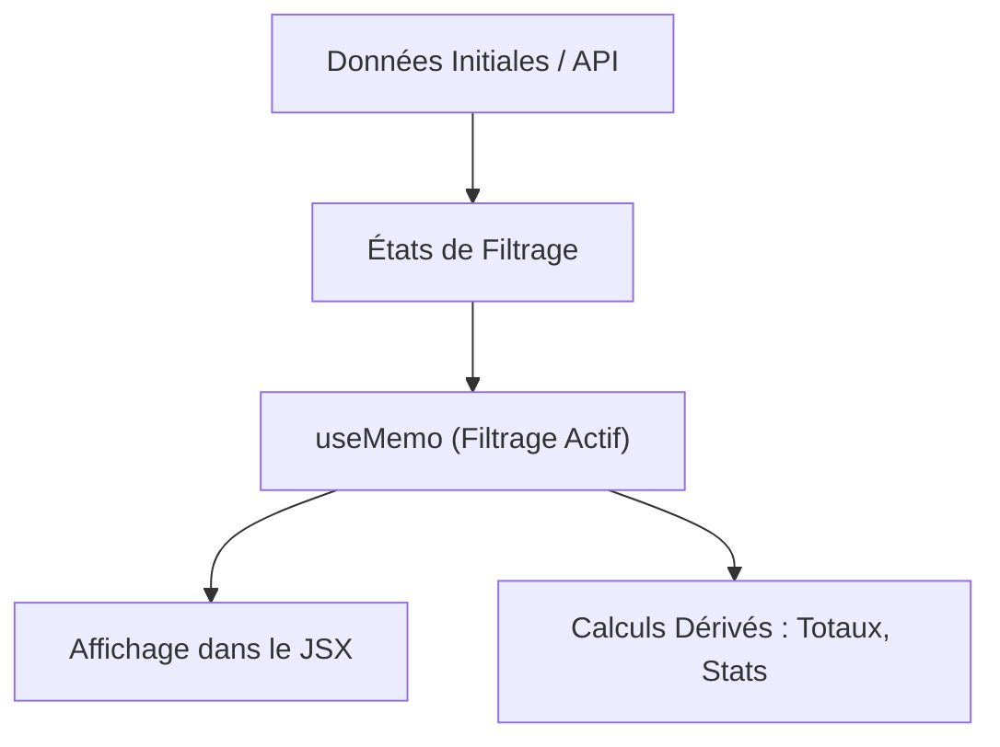

# Guide d'Apprentissage : Fonctionnalités de Filtrage Général et Filtre par Date

Ce guide explique les concepts généraux du **filtrage de données côté client** dans une application React, avec un focus particulier sur la mise en œuvre d'un **filtre par date** (période, date de début, date de fin, etc.). 

Il s'agit d'un scénario classique d'évaluation pour les tableaux de bord et les listes de données.

---

## 1. Principes Généraux du Filtrage Dynamique en React

Pour filtrer efficacement des données en React (sans requêtes API répétées), on applique un **filtrage déclaratif** basé sur l'état (`state`) de l'application.



### Les règles de base :
1. **Source unique de vérité** : Conservez toujours la liste originale intacte (ex: `tickets` ou `assets`).
2. **Ne dupliquez pas la liste filtrée dans un `useState`** : Calculez-la dynamiquement à l'aide d'un `useMemo` dépendant de la liste originale et des critères de recherche.
3. **Réinitialisation simple** : Fournissez toujours un bouton pour vider tous les filtres d'un coup.

---

## 2. Le Cas Particulier du Filtrage par Date

Filtrer par date comporte plusieurs défis :
- **Formats hétérogènes** : ISO 8601 (`2026-06-12T09:38:07Z`), Timestamps, ou chaînes simples (`YYYY-MM-DD`).
- **Fuseaux horaires** : Risques de décalage d'un jour selon l'heure locale.
- **Saisie de l'utilisateur** : L'input `<input type="date" />` renvoie une chaîne au format `YYYY-MM-DD`.

### Stratégies de comparaison de dates en JS :

#### Option A : Comparaison Lexicographique (Recommandée si format ISO `YYYY-MM-DD`)
Si la date du ticket et celle du filtre sont toutes deux au format `YYYY-MM-DD` (ou si vous extrayez les 10 premiers caractères : `dateString.substring(0, 10)`), vous pouvez utiliser les opérateurs standard (`>=`, `<=`, `===`) directement sur les chaînes de caractères !
*Exemple : `"2026-06-12" >= "2026-06-10"` est vrai.*

#### Option B : Comparaison d'objets `Date` (Plus robuste pour tout format)
Convertissez les chaînes en objets `Date` et comparez leurs timestamps en millisecondes :
```javascript
const itemTime = new Date(item.date).getTime();
const startTime = new Date(startDate).getTime();
```

---

## 3. Exemple Complet : Composant de Filtrage par Date et Recherche

Voici une implémentation propre et réutilisable dans React :

```jsx
import React, { useState, useMemo } from 'react';

export default function GenericDataFilterList({ items = [] }) {
  // 1. États pour les filtres
  const [searchTerm, setSearchTerm] = useState('');
  const [startDate, setStartDate] = useState('');
  const [endDate, setEndDate] = useState('');

  // 2. Logique de filtrage optimisée
  const filteredItems = useMemo(() => {
    return items.filter(item => {
      // --- FILTRE A : Recherche textuelle ---
      if (searchTerm) {
        const term = searchTerm.toLowerCase();
        const matchesName = item.name?.toLowerCase().includes(term);
        const matchesDesc = item.description?.toLowerCase().includes(term);
        if (!matchesName && !matchesDesc) return false;
      }

      // --- FILTRE B : Date de début (Min) ---
      if (startDate) {
        // Extraction de la partie date YYYY-MM-DD du ticket
        const itemDateStr = item.created_date ? item.created_date.substring(0, 10) : '';
        if (itemDateStr < startDate) {
          return false; // L'élément est antérieur à la date de début
        }
      }

      // --- FILTRE C : Date de fin (Max) ---
      if (endDate) {
        const itemDateStr = item.created_date ? item.created_date.substring(0, 10) : '';
        if (itemDateStr > endDate) {
          return false; // L'élément est postérieur à la date de fin
        }
      }

      return true; // L'élément remplit tous les critères
    });
  }, [items, searchTerm, startDate, endDate]);

  // 3. Fonction pour réinitialiser les filtres
  const handleClearFilters = () => {
    setSearchTerm('');
    setStartDate('');
    setEndDate('');
  };

  return (
    <div className="p-6 max-w-4xl mx-auto">
      <h2 className="text-xl font-bold mb-4">Filtrage de Données</h2>

      {/* Barre d'outils des Filtres */}
      <div className="bg-gray-100 p-4 rounded-lg mb-6 grid grid-cols-1 md:grid-cols-4 gap-4 items-end">
        
        {/* Recherche texte */}
        <div>
          <label className="block text-xs font-semibold uppercase text-gray-500 mb-1">Recherche</label>
          <input
            type="text"
            className="w-full p-2 border rounded bg-white"
            placeholder="Rechercher..."
            value={searchTerm}
            onChange={(e) => setSearchTerm(e.target.value)}
          />
        </div>

        {/* Date Début */}
        <div>
          <label className="block text-xs font-semibold uppercase text-gray-500 mb-1">Du (Date Début)</label>
          <input
            type="date"
            className="w-full p-2 border rounded bg-white"
            value={startDate}
            onChange={(e) => setStartDate(e.target.value)}
          />
        </div>

        {/* Date Fin */}
        <div>
          <label className="block text-xs font-semibold uppercase text-gray-500 mb-1">Au (Date Fin)</label>
          <input
            type="date"
            className="w-full p-2 border rounded bg-white"
            value={endDate}
            onChange={(e) => setEndDate(e.target.value)}
          />
        </div>

        {/* Action de reset */}
        <div>
          <button
            onClick={handleClearFilters}
            className="w-full p-2 bg-red-500 text-white rounded hover:bg-red-600 transition-colors"
          >
            Réinitialiser
          </button>
        </div>
      </div>

      {/* Compteur et Liste des résultats */}
      <div className="mb-2 text-sm text-gray-600">
        <strong>{filteredItems.length}</strong> éléments trouvés sur {items.length} au total.
      </div>

      <div className="space-y-2">
        {filteredItems.map(item => (
          <div key={item.id} className="p-4 border rounded shadow-sm bg-white flex justify-between items-center">
            <div>
              <h4 className="font-bold">{item.name}</h4>
              <p className="text-sm text-gray-500">{item.description}</p>
            </div>
            <div className="text-right">
              <span className="text-xs font-mono bg-blue-100 text-blue-800 px-2 py-1 rounded">
                {item.created_date ? item.created_date.substring(0, 10) : 'Pas de date'}
              </span>
            </div>
          </div>
        ))}
      </div>
    </div>
  );
}
```

---

## 4. Bonnes Pratiques pour l'Examen

1. **Sécurité contre les valeurs `null`** : Toujours vérifier si le champ de date de l'objet existe avant de faire un `.substring()` ou une comparaison :
   ```javascript
   const itemDate = item.date_creation || '';
   ```
2. **Comparaison inclusive** : Pour s'assurer qu'un filtre du `"2026-06-12"` inclut les événements créés ce même jour (même s'ils contiennent une partie heure comme `2026-06-12T14:30:00Z`), utilisez la méthode de troncature de chaîne `substring(0, 10)`. Cela ramène la date à `YYYY-MM-DD` pour une comparaison stricte sans pollution de fuseau horaire.
3. **Tri Chronologique par défaut** : Lors de l'affichage d'une liste de dates, triez-la souvent par ordre décroissant (plus récent au plus ancien) pour améliorer l'expérience utilisateur :
   ```javascript
   const sortedItems = [...filteredItems].sort((a, b) => 
     new Date(b.created_date) - new Date(a.created_date)
   );
   ```
