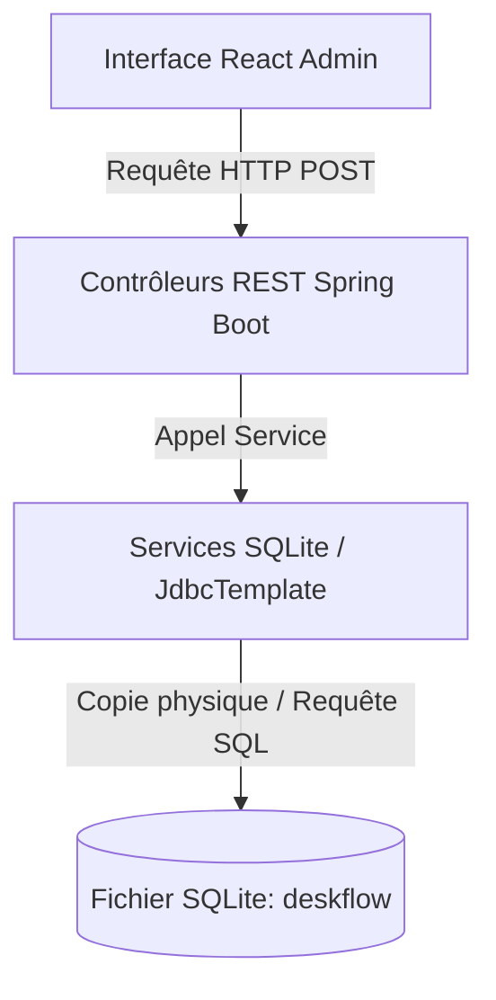

# Guide Complet des Fonctions Utilitaires SQLite

Ce guide regroupe toutes les fonctions utilitaires pour administrer, sauvegarder, restaurer et réinitialiser la base de données locale **SQLite** de l'application via **Spring Boot** (Backend) et **React** (Frontend).

---

## 1. Structure Globale de l'Architecture

Les utilitaires sont répartis entre le backend (Spring Boot pour les opérations système et SQL de bas niveau) et le frontend (React pour déclencher les actions).



---

## 2. Implémentation Backend (Spring Boot — Java)

### 2.1. Contrôleur de Réinitialisation et Réensemencement (`DatabaseResetController.java`)
*Fichier :* `sqlite/src/main/java/com/eval/sqlite/controller/DatabaseResetController.java`

> [!IMPORTANT]
> Ce contrôleur vide toutes les données des tables de configuration locales et réinitialise les séquences d'auto-incrémentation.

```java
package com.eval.sqlite.controller;

import org.springframework.beans.factory.annotation.Autowired;
import org.springframework.web.bind.annotation.*;
import org.springframework.jdbc.core.JdbcTemplate;
import com.eval.sqlite.model.Translation;
import com.eval.sqlite.model.Color;
import com.eval.sqlite.model.AppUser;
import com.eval.sqlite.repository.TranslationRepository;
import com.eval.sqlite.repository.ColorRepository;
import com.eval.sqlite.repository.AppUserRepository;

import java.util.Arrays;
import java.util.HashMap;
import java.util.Map;

@CrossOrigin(origins = "http://localhost:5173")
@RestController
@RequestMapping("/api/db")
public class DatabaseResetController {

    @Autowired
    private TranslationRepository translationRepository;

    @Autowired
    private ColorRepository colorRepository;

    @Autowired
    private AppUserRepository userRepository;

    @Autowired
    private JdbcTemplate jdbcTemplate;

    @PostMapping("/reset")
    public Map<String, Object> resetDatabase() {
        Map<String, Object> response = new HashMap<>();
        try {
            // 1. Vider les tables
            translationRepository.deleteAll();
            colorRepository.deleteAll();
            userRepository.deleteAll();

            // 2. Remettre à zéro les compteurs d'auto-incrémentation SQLite
            jdbcTemplate.execute("DELETE FROM sqlite_sequence WHERE name IN ('translations', 'colors', 'app_users')");

            // 3. Réensemencer les traductions par défaut
            translationRepository.saveAll(Arrays.asList(
                new Translation("fr", "nouveau", "Nouveau"),
                new Translation("fr", "in_progress", "En cours"),
                new Translation("fr", "termine", "Terminé"),
                new Translation("mg", "nouveau", "Vaovao"),
                new Translation("mg", "in_progress", "An-dalana"),
                new Translation("mg", "termine", "Vita")
            ));

            // 4. Réensemencer les couleurs par défaut
            colorRepository.saveAll(Arrays.asList(
                new Color("#22c55e", "nouveau", "Vaovao"),
                new Color("#f97316", "in_progress", "Efa manao"),
                new Color("#ef4444", "termine", "Vita")
            ));

            // 5. Réensemencer l'utilisateur par défaut
            AppUser defaultUser = new AppUser();
            defaultUser.setUsername("admin");
            defaultUser.setPassword("admin123");
            userRepository.save(defaultUser);

            response.put("success", true);
            response.put("message", "Base de données réinitialisée et réensemencée avec succès.");
        } catch (Exception e) {
            response.put("success", false);
            response.put("error", e.getMessage());
        }
        return response;
    }
}
```

### 2.2. Contrôleur de Sauvegarde et Restauration Physique (`DatabaseBackupController.java`)
*Fichier :* `sqlite/src/main/java/com/eval/sqlite/controller/DatabaseBackupController.java`

> [!TIP]
> SQLite stockant les données dans un seul fichier physique `deskflow`, la méthode la plus rapide et fiable de sauvegarde/restauration consiste à faire une copie physique de ce fichier.

```java
package com.eval.sqlite.controller;

import org.springframework.web.bind.annotation.*;
import java.io.File;
import java.io.IOException;
import java.nio.file.Files;
import java.nio.file.StandardCopyOption;
import java.util.HashMap;
import java.util.Map;

@CrossOrigin(origins = "http://localhost:5173")
@RestController
@RequestMapping("/api/db/backup")
public class DatabaseBackupController {

    private final String DB_FILE_PATH = "deskflow";
    private final String BACKUP_FILE_PATH = "deskflow.bak";

    // 1. Sauvegarde physique du fichier SQLite
    @PostMapping("/create")
    public Map<String, Object> createBackup() {
        Map<String, Object> response = new HashMap<>();
        File dbFile = new File(DB_FILE_PATH);
        File backupFile = new File(BACKUP_FILE_PATH);

        if (!dbFile.exists()) {
            response.put("success", false);
            response.put("message", "Le fichier de BDD n'existe pas : " + dbFile.getAbsolutePath());
            return response;
        }

        try {
            Files.copy(dbFile.toPath(), backupFile.toPath(), StandardCopyOption.REPLACE_EXISTING);
            response.put("success", true);
            response.put("message", "Sauvegarde créée avec succès : " + backupFile.getName());
            response.put("sizeBytes", backupFile.length());
        } catch (IOException e) {
            response.put("success", false);
            response.put("error", e.getMessage());
        }
        return response;
    }

    // 2. Restauration du fichier SQLite
    @PostMapping("/restore")
    public Map<String, Object> restoreBackup() {
        Map<String, Object> response = new HashMap<>();
        File dbFile = new File(DB_FILE_PATH);
        File backupFile = new File(BACKUP_FILE_PATH);

        if (!backupFile.exists()) {
            response.put("success", false);
            response.put("message", "Aucun fichier de sauvegarde trouvé.");
            return response;
        }

        try {
            Files.copy(backupFile.toPath(), dbFile.toPath(), StandardCopyOption.REPLACE_EXISTING);
            response.put("success", true);
            response.put("message", "Restauration effectuée avec succès.");
        } catch (IOException e) {
            response.put("success", false);
            response.put("error", e.getMessage());
        }
        return response;
    }
}
```

### 2.3. Contrôleur de Requêtes SQL Natives en Lecture Seule (`DatabaseQueryController.java`)
*Fichier :* `sqlite/src/main/java/com/eval/sqlite/controller/DatabaseQueryController.java`

```java
package com.eval.sqlite.controller;

import org.springframework.beans.factory.annotation.Autowired;
import org.springframework.web.bind.annotation.*;
import org.springframework.jdbc.core.JdbcTemplate;
import java.util.HashMap;
import java.util.List;
import java.util.Map;

@CrossOrigin(origins = "http://localhost:5173")
@RestController
@RequestMapping("/api/db/query")
public class DatabaseQueryController {

    @Autowired
    private JdbcTemplate jdbcTemplate;

    @PostMapping
    public Map<String, Object> executeQuery(@RequestBody Map<String, String> payload) {
        Map<String, Object> response = new HashMap<>();
        String sql = payload.get("sql");

        if (sql == null || sql.trim().isEmpty()) {
            response.put("success", false);
            response.put("error", "La requête SQL ne peut pas être vide.");
            return response;
        }

        // Sécurité élémentaire : Lecture seule
        String cleanSql = sql.trim().toUpperCase();
        if (!cleanSql.startsWith("SELECT") && !cleanSql.startsWith("PRAGMA")) {
            response.put("success", false);
            response.put("error", "Seules les requêtes SELECT et PRAGMA sont autorisées via cet endpoint.");
            return response;
        }

        try {
            List<Map<String, Object>> rows = jdbcTemplate.queryForList(sql);
            response.put("success", true);
            response.put("results", rows);
            response.put("rowCount", rows.size());
        } catch (Exception e) {
            response.put("success", false);
            response.put("error", e.getMessage());
        }
        return response;
    }
}
```

---

## 3. Implémentation Frontend (React — JavaScript)

Voici le code JavaScript à placer dans un fichier d'API de service (par exemple `src/services/sqliteAdminService.js`) pour appeler les utilitaires backend :

```javascript
const API_BASE_URL = 'http://localhost:8081/api/db';

/**
 * Réinitialise la base SQLite aux valeurs d'usine
 */
export async function resetDatabase() {
  const response = await fetch(`${API_BASE_URL}/reset`, { method: 'POST' });
  if (!response.ok) throw new Error("Erreur de réinitialisation");
  return await response.json();
}

/**
 * Sauvegarde physique de la base de données
 */
export async function backupDatabase() {
  const response = await fetch(`${API_BASE_URL}/backup/create`, { method: 'POST' });
  if (!response.ok) throw new Error("Erreur de sauvegarde");
  return await response.json();
}

/**
 * Restaure la base de données
 */
export async function restoreDatabase() {
  const response = await fetch(`${API_BASE_URL}/backup/restore`, { method: 'POST' });
  if (!response.ok) throw new Error("Erreur de restauration");
  return await response.json();
}

/**
 * Exécute une requête SELECT SQL native brute sur SQLite
 */
export async function executeRawSelect(sqlQuery) {
  const response = await fetch(`${API_BASE_URL}/query`, {
    method: 'POST',
    headers: { 'Content-Type': 'application/json' },
    body: JSON.stringify({ sql: sqlQuery })
  });
  if (!response.ok) throw new Error("Erreur de requête");
  return await response.json();
}
```

---

## 4. Utilitaires d'Administration en Ligne de Commande (CLI)

Si vous devez faire des diagnostics rapides de la base de données SQLite à l'aide de l'outil `sqlite3` :

| Action | Commande SQLite CLI |
|--------|---------------------|
| Se connecter à la base | `sqlite3 deskflow` |
| Afficher les tables | `.tables` |
| Afficher le schéma d'une table | `.schema name_of_table` |
| Activer le mode colonne lisible | `.mode column` et `.headers on` |
| Optimiser la taille du fichier | `VACUUM;` |
| Quitter l'outil CLI | `.exit` |
