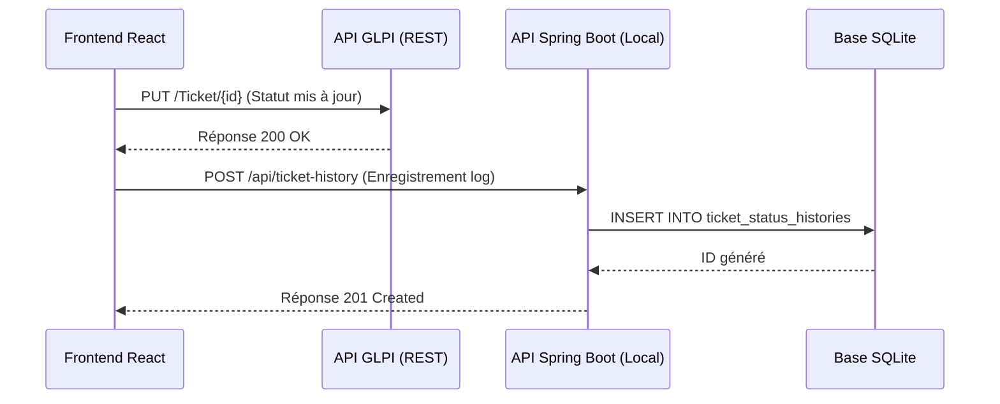

# Scénario : Enregistrement de l'Historique des Statuts de Ticket dans SQLite

Ce guide détaille comment mettre en œuvre l'enregistrement et la consultation de l'historique des statuts de tickets dans la base de données locale **SQLite** via **Spring Boot** en parallèle avec la synchronisation dans l'API REST de **GLPI** (méthode du *Dual-Write*).

---

## 1. Objectif du Scénario
Lorsqu'un ticket change de statut (soit par Glisser-Déposer dans le Kanban, soit via l'interface de détails), le système doit :
1. **Mettre à jour GLPI** (source de données principale via l'API REST).
2. **Enregistrer l'historique dans SQLite** (base de configuration et d'audit locale) pour garder une trace fine et temporelle de chaque transition de statut : *Qui a changé le statut, quand, et quelles étaient les anciennes et nouvelles valeurs ?*

---

## 2. Architecture des Composants



---

## 3. Implémentation Backend (Spring Boot & SQLite)

### 3.1. Le Modèle JPA (`TicketStatusHistory.java`)
Créez le fichier dans : `sqlite/src/main/java/com/eval/sqlite/model/TicketStatusHistory.java`

> [!IMPORTANT]
> Pour SQLite, utilisez impérativement la stratégie de génération `GenerationType.IDENTITY` pour l'auto-incrémentation.

```java
package com.eval.sqlite.model;

import jakarta.persistence.*;
import java.time.LocalDateTime;

@Entity
@Table(name = "ticket_status_histories")
public class TicketStatusHistory {

    @Id
    @GeneratedValue(strategy = GenerationType.IDENTITY)
    private Long id;

    @Column(name = "ticket_id", nullable = false)
    private Long ticketId;

    @Column(name = "old_status", nullable = false)
    private String oldStatus;

    @Column(name = "new_status", nullable = false)
    private String newStatus;

    @Column(name = "changed_by")
    private String changedBy;

    @Column(name = "change_date")
    private LocalDateTime changeDate;

    // Constructeurs
    public TicketStatusHistory() {
        this.changeDate = LocalDateTime.now();
    }

    public TicketStatusHistory(Long ticketId, String oldStatus, String newStatus, String changedBy) {
        this.ticketId = ticketId;
        this.oldStatus = oldStatus;
        this.newStatus = newStatus;
        this.changedBy = changedBy;
        this.changeDate = LocalDateTime.now();
    }

    // Getters et Setters
    public Long getId() { return id; }
    public void setId(Long id) { this.id = id; }

    public Long getTicketId() { return ticketId; }
    public void setTicketId(Long ticketId) { this.ticketId = ticketId; }

    public String getOldStatus() { return oldStatus; }
    public void setOldStatus(String oldStatus) { this.oldStatus = oldStatus; }

    public String getNewStatus() { return newStatus; }
    public void setNewStatus(String newStatus) { this.newStatus = newStatus; }

    public String getChangedBy() { return changedBy; }
    public void setChangedBy(String changedBy) { this.changedBy = changedBy; }

    public LocalDateTime getChangeDate() { return changeDate; }
    public void setChangeDate(LocalDateTime changeDate) { this.changeDate = changeDate; }
}
```

### 3.2. Le Repository (`TicketStatusHistoryRepository.java`)
Créez le fichier dans : `sqlite/src/main/java/com/eval/sqlite/repository/TicketStatusHistoryRepository.java`

```java
package com.eval.sqlite.repository;

import org.springframework.data.jpa.repository.JpaRepository;
import com.eval.sqlite.model.TicketStatusHistory;
import java.util.List;

public interface TicketStatusHistoryRepository extends JpaRepository<TicketStatusHistory, Long> {
    
    // Récupérer l'historique d'un ticket classé du plus récent au plus ancien
    List<TicketStatusHistory> findByTicketIdOrderByChangeDateDesc(Long ticketId);
}
```

### 3.3. Le Contrôleur REST (`TicketStatusHistoryController.java`)
Créez le fichier dans : `sqlite/src/main/java/com/eval/sqlite/controller/TicketStatusHistoryController.java`

> [!WARNING]
> N'oubliez pas l'annotation `@CrossOrigin` pour éviter les erreurs CORS sur le frontend.

```java
package com.eval.sqlite.controller;

import org.springframework.beans.factory.annotation.Autowired;
import org.springframework.web.bind.annotation.*;
import com.eval.sqlite.model.TicketStatusHistory;
import com.eval.sqlite.repository.TicketStatusHistoryRepository;
import java.util.List;

@CrossOrigin(origins = "http://localhost:5173")
@RestController
@RequestMapping("/api/ticket-history")
public class TicketStatusHistoryController {

    @Autowired
    private TicketStatusHistoryRepository historyRepository;

    // 1. Récupérer l'historique d'un ticket spécifique (GET)
    @GetMapping("/ticket/{ticketId}")
    public List<TicketStatusHistory> getHistoryByTicket(@PathVariable Long ticketId) {
        return historyRepository.findByTicketIdOrderByChangeDateDesc(ticketId);
    }

    // 2. Enregistrer une nouvelle transition de statut (POST)
    @PostMapping
    public TicketStatusHistory saveHistory(@RequestBody TicketStatusHistory history) {
        // Garantir que la date de changement est bien initialisée à la date serveur s'il elle est nulle
        if (history.getChangeDate() == null) {
            history.setChangeDate(java.time.LocalDateTime.now());
        }
        return historyRepository.save(history);
    }
}
```

---

## 4. Implémentation Frontend (React)

### 4.1. Service API (`src/services/ticketHistoryService.js`)
Créez un nouveau fichier de service pour gérer les appels vers notre API Spring Boot :

```javascript
const SPRING_API_URL = 'http://localhost:8081/api/ticket-history';

/**
 * Enregistre un changement de statut dans SQLite.
 */
export async function logStatusChange(ticketId, oldStatus, newStatus, changedBy = 'admin') {
  try {
    const response = await fetch(SPRING_API_URL, {
      method: 'POST',
      headers: {
        'Content-Type': 'application/json',
      },
      body: JSON.stringify({
        ticketId: parseInt(ticketId, 10),
        oldStatus: String(oldStatus),
        newStatus: String(newStatus),
        changedBy: String(changedBy)
      }),
    });
    if (!response.ok) {
      throw new Error(`HTTP error! status: ${response.status}`);
    }
    return await response.json();
  } catch (error) {
    console.error("Erreur lors de l'enregistrement de l'historique dans SQLite :", error);
  }
}

/**
 * Récupère l'historique des statuts depuis SQLite.
 */
export async function fetchStatusHistory(ticketId) {
  try {
    const response = await fetch(`${SPRING_API_URL}/ticket/${ticketId}`);
    if (!response.ok) {
      throw new Error(`HTTP error! status: ${response.status}`);
    }
    return await response.json();
  } catch (error) {
    console.error("Erreur de récupération de l'historique SQLite :", error);
    return [];
  }
}
```

### 4.2. Branchement dans l'action de changement de statut
Modifiez le helper de statut (`src/utils/ticketHelper.js`) pour enregistrer la modification dans SQLite après le succès sur GLPI :

```javascript
import { fetchDataAPIRest } from '../services/apiClient';
import { logStatusChange } from '../services/ticketHistoryService';

// Traduction locale des IDs de statut GLPI pour SQLite
const getStatusLabelFromId = (id) => {
  const map = { 1: 'Nouveau', 2: 'En cours', 3: 'En cours (Planifié)', 4: 'En attente', 5: 'Résolu', 6: 'Clos' };
  return map[id] || `Statut ${id}`;
};

export async function updateTicketStatus(ticketId, newStatusId, oldStatusId = 1, username = 'admin') {
  try {
    // 1. Mettre à jour dans GLPI
    const response = await fetchDataAPIRest(`/Ticket/${ticketId}`, {
      method: 'PUT',
      body: {
        input: {
          id: ticketId,
          status: newStatusId
        }
      }
    });
    console.log('Statut mis à jour dans GLPI:', response);

    // 2. Enregistrer l'historique dans SQLite
    const oldStatusLabel = getStatusLabelFromId(oldStatusId);
    const newStatusLabel = getStatusLabelFromId(newStatusId);
    
    await logStatusChange(ticketId, oldStatusLabel, newStatusLabel, username);
    console.log('Historique de statut enregistré dans SQLite');
    
  } catch (error) {
    console.error('Erreur lors de la mise à jour du statut:', error);
  }
}
```

*Note : Lors du glisser-déposer dans `TicketKanban.jsx`, passez le `sourceColId` (l'ancien statut) pour pouvoir l'enregistrer correctement.*

---

## 5. Composant UI Timeline SQLite (`TicketStatusHistoryTimeline.jsx`)
Créez ce composant dans `src/components/ticket/TicketStatusHistoryTimeline.jsx` pour afficher l'historique local.

```jsx
import { useState, useEffect } from 'react';
import { fetchStatusHistory } from '../../services/ticketHistoryService';
import { Spinner } from '../templates';

export default function TicketStatusHistoryTimeline({ ticketId }) {
  const [history, setHistory] = useState([]);
  const [loading, setLoading] = useState(true);

  useEffect(() => {
    async function loadHistory() {
      setLoading(true);
      const data = await fetchStatusHistory(ticketId);
      setHistory(data);
      setLoading(false);
    }
    loadHistory();
  }, [ticketId]);

  if (loading) return <Spinner label="Chargement de l'historique SQLite..." />;
  if (history.length === 0) return <p className="text-gray-400 italic text-sm">Aucun changement de statut enregistré localement.</p>;

  return (
    <div className="flow-root py-4 font-sans text-black">
      <h3 className="font-bold text-sm mb-4 uppercase tracking-wider text-neutral-500">Historique local (SQLite)</h3>
      <ul className="-mb-8">
        {history.map((event, idx) => (
          <li key={event.id}>
            <div className="relative pb-8">
              {/* Ligne verticale de connexion */}
              {idx !== history.length - 1 && (
                <span className="absolute top-4 left-4 -ml-px h-full w-0.5 bg-neutral-200" aria-hidden="true" />
              )}
              
              <div className="relative flex space-x-3 items-start">
                <div>
                  <span className="h-8 w-8 rounded-full bg-neutral-900 flex items-center justify-center ring-8 ring-white text-white">
                    <svg className="w-4 h-4" fill="none" stroke="currentColor" strokeWidth="2" viewBox="0 0 24 24">
                      <path strokeLinecap="round" strokeLinejoin="round" d="M12 6v6h4.5m4.5 0a9 9 0 1 1-18 0 9 9 0 0 1 18 0Z" />
                    </svg>
                  </span>
                </div>

                <div className="flex-1 min-w-0 pt-1.5 flex justify-between space-x-4">
                  <div>
                    <p className="text-sm text-neutral-800">
                      Transition par <span className="font-semibold text-black">{event.changedBy}</span> :{' '}
                      <span className="line-through text-neutral-400">{event.oldStatus}</span>
                      <span className="mx-2 text-neutral-400">→</span>
                      <span className="font-bold text-neutral-900">{event.newStatus}</span>
                    </p>
                  </div>
                  <div className="text-right text-xs whitespace-nowrap text-neutral-400 self-start">
                    <time dateTime={event.changeDate}>
                      {new Date(event.changeDate).toLocaleString('fr-FR', {
                        day: '2-digit',
                        month: 'short',
                        hour: '2-digit',
                        minute: '2-digit'
                      })}
                    </time>
                  </div>
                </div>
              </div>
            </div>
          </li>
        ))}
      </ul>
    </div>
  );
}
```

---

## 6. Vérification de la Base de Données

Puisque SQLite utilise le fichier `deskflow`, vous pouvez exécuter la requête suivante dans la console SQL Spring Boot (ou via votre gestionnaire de base de données DB Browser for SQLite) pour vérifier la structure de la table créée automatiquement :

```sql
SELECT * FROM ticket_status_histories;
```

### Exemple de retour attendu :
| id | ticket_id | old_status | new_status | changed_by | change_date |
|----|-----------|------------|------------|------------|-------------|
| 1  | 120       | Nouveau    | En cours   | admin      | 2026-06-12 08:30:15 |
| 2  | 120       | En cours   | Résolu     | admin      | 2026-06-12 09:15:40 |
