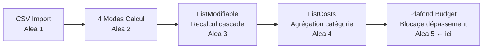

# Scénario Aléatoire 5 — Plafond de Budget par Catégorie

## Contexte

Jusqu'ici le système gère :

| Scénario | Ce qui a été fait |
|---|---|
| **Alea 1** | Import CSV (ticket / mvt / valeur) → close, open, cancel |
| **Alea 2** | 4 modes de calcul pour la réouverture (dernier, premier, moyenne, somme) |
| **Alea 3** | Page ListModifiable : modifier mode/valeur d'une réouverture ou cout d'un supercost → recalcul automatique |
| **Alea 4** | Page ListCosts : vue agrégée par catégorie (Computer/Monitor/Phone) avec détails par ticket |

> Le prof a rappelé qu'il faut **bien maîtriser le scénario actuel** (modification + recalcul en cascade) avant de passer au suivant.

---

## Scénario Proposé — **Plafond de Budget Autorisé par Catégorie**

### Idée Générale

On définit un **budget maximum autorisé** pour chaque catégorie d'équipement (Computer, Monitor, Phone).  
Quand la **somme cumulée** (Supercouts + Réouvertures) d'une catégorie **dépasse ce plafond**, le système :

1. **Bloque** tout nouvel import/ajout de coût pour cette catégorie
2. **Affiche une alerte visuelle** dans ListCosts (ligne rouge + badge "DÉPASSÉ")
3. **Enregistre un événement** de dépassement dans une nouvelle table SQLite `budget_alerte`

### Exemple concret

```
Plafond Computer = 1 000 €
Situation actuelle Computer : Supercout = 832,68 € + Réouverture = 150 € = 982,68 €
→ Prochain close de 50 € → total serait 1 032,68 € → DÉPASSEMENT → BLOQUÉ
```

---

## Données CSV (nouvelle colonne optionnelle)

Le fichier CSV pourrait recevoir une **5e colonne facultative** `plafond` pour définir/mettre à jour le budget max d'une catégorie :

```
ticket,mvt,valeur,mode,plafond
Computer,,,,1000
Monitor,,,,500
Phone,,,,300
1,close,200,,
2,open,10,3,
```

> Si `ticket` est vide et `mvt` est vide → c'est une ligne de **paramétrage de plafond** pour la catégorie indiquée dans la colonne `plafond`.

---

## Architecture Technique

### Côté Java (Spring Boot / SQLite)

#### [NEW] Model : `BudgetPlafond.java`

```java
@Entity
@Table(name = "budget_plafond")
public class BudgetPlafond {
    @Id
    @GeneratedValue(strategy = GenerationType.IDENTITY)
    private Long id;
    private String category;   // "Computer" | "Monitor" | "Phone"
    private double plafond;    // montant maximum autorisé
    private Long updatedAt;    // timestamp de la dernière modif
}
```

#### [NEW] Repository : `BudgetPlafondRepository.java`

```java
Optional<BudgetPlafond> findByCategory(String category);
```

#### [MODIFY] Controller : `CoutController.java`

Nouveaux endpoints à ajouter :

```
GET  /api/plafonds                  → liste tous les plafonds
GET  /api/plafonds/{category}       → plafond d'une catégorie
POST /api/plafonds                  → créer ou mettre à jour un plafond
GET  /api/plafonds/check/{category} → retourne { depasse: true/false, total: X, plafond: Y }
```

La vérification dans `closeTicketWithCosts` / `recalculateTicket` :
- Après chaque insertion/recalcul, appeler la vérification
- Si `total > plafond` → lever une exception `BudgetDepasseException`

---

### Côté JavaScript (Deskflow / React)

#### [NEW] Service : `budgetService.js`

```js
// Fonctions à créer :
export async function getAllPlafonds()          // GET /api/plafonds
export async function getPlafond(category)     // GET /api/plafonds/{category}
export async function savePlafond(category, montant) // POST /api/plafonds
export async function checkPlafond(category)   // GET /api/plafonds/check/{category}
```

#### [MODIFY] `importSqlite.js`

```js
// Avant chaque closeTicketWithCosts() ou reopenTicketWithCosts() :
const check = await checkPlafond(categoryDuTicket);
if (check.depasse) {
  throw new Error(`Plafond dépassé pour ${categoryDuTicket} : ${check.total} > ${check.plafond}`);
}

// Nouveau parsing : ligne de type "plafond" si ticket et mvt vides
if (!ticket && !mvt && plafond && category) {
  await savePlafond(category, parseFloat(plafond));
  continue;
}
```

#### [NEW] Page : `BudgetPlafond.jsx` (backoffice)

Interface pour **configurer les plafonds** par catégorie :
- Tableau avec Computer / Monitor / Phone
- Champ de saisie du montant max
- Bouton Sauvegarder par ligne
- Indicateur visuel du taux de consommation (barre de progression)

#### [MODIFY] `ListCosts.jsx` (frontoffice)

- Appel à `checkPlafond()` pour chaque catégorie au chargement
- Si dépassé → ligne en **rouge** + badge `⚠ DÉPASSÉ`
- Afficher une barre de progression : `total / plafond * 100%`

```jsx
// Exemple de rendu dans le tableau :
<Td className={depasse ? "text-red-600 font-bold" : ""}>
  {data.supercost + data.reouverture} / {plafond} €
  {depasse && <Badge variant="danger">DÉPASSÉ</Badge>}
</Td>
```

---

## Fonctions à Créer ou Modifier (Résumé)

| Fichier | Action | Description |
|---|---|---|
| `BudgetPlafond.java` | **CRÉER** | Nouveau modèle JPA |
| `BudgetPlafondRepository.java` | **CRÉER** | Repository avec `findByCategory()` |
| `BudgetPlafondController.java` | **CRÉER** | Endpoints CRUD + check |
| `CoutController.java` | **MODIFIER** | Appel vérification plafond dans `recalculateTicket()` |
| `budgetService.js` | **CRÉER** | Fonctions fetch vers les nouveaux endpoints |
| `importSqlite.js` | **MODIFIER** | Parsing ligne plafond + vérification avant import |
| `BudgetPlafond.jsx` | **CRÉER** | Page de config des plafonds (backoffice) |
| `ListCosts.jsx` | **MODIFIER** | Affichage du dépassement + barre de progression |
| `App.jsx` | **MODIFIER** | Ajouter la route `/backoffice/budget-plafond` |
| `SidebarLayout.jsx` | **MODIFIER** | Ajouter le lien dans le menu |

---

## Pourquoi ce scénario est cohérent avec ce qu'on a fait ?



- On **réutilise** `ListCosts.jsx` déjà fait (on l'enrichit)  
- On **réutilise** `importSqlite.js` déjà fait (on ajoute la vérification)  
- On **réutilise** le `recalculateTicket()` de `CoutController.java` (on y branche la vérif)  
- Le prof pourra voir que **tout s'enchaîne logiquement** depuis le début

---

## Ce qu'il faut comprendre avant de commencer

> [!IMPORTANT]
> Avant de coder ce scénario, s'assurer que le scénario 3 (ListModifiable + recalcul) fonctionne correctement — notamment le fix de la virgule (`/100.0`) qui vient d'être corrigé.

1. **Comment fonctionne `recalculateTicket()`** → parcourt tous les groupes d'un ticket dans l'ordre chronologique (via `grp` = timestamp) et recalcule chaque réouverture selon son mode
2. **Comment fonctionne le `grp`** → c'est un timestamp en millisecondes utilisé comme identifiant de groupe d'un même événement
3. **Comment les catégories sont mappées** → via `getNormalizedCategory()` dans `ListCosts.jsx` + le champ `category` dans la table `couts`
